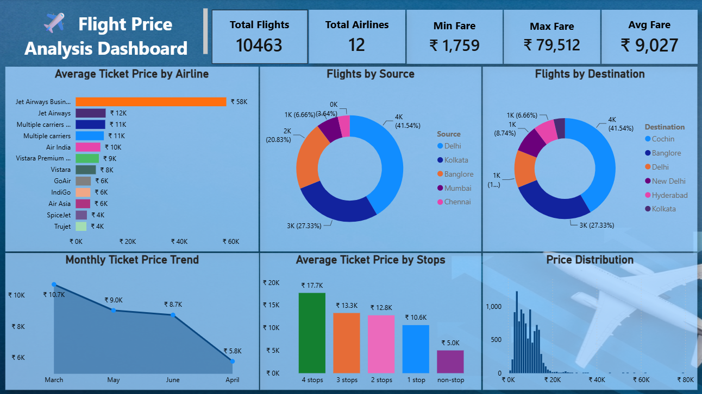
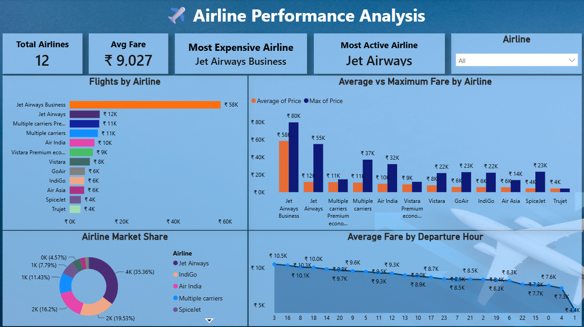
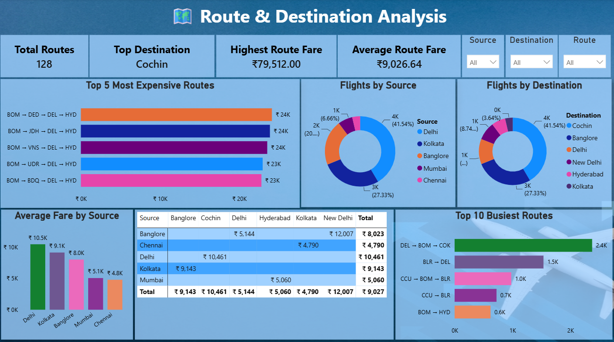
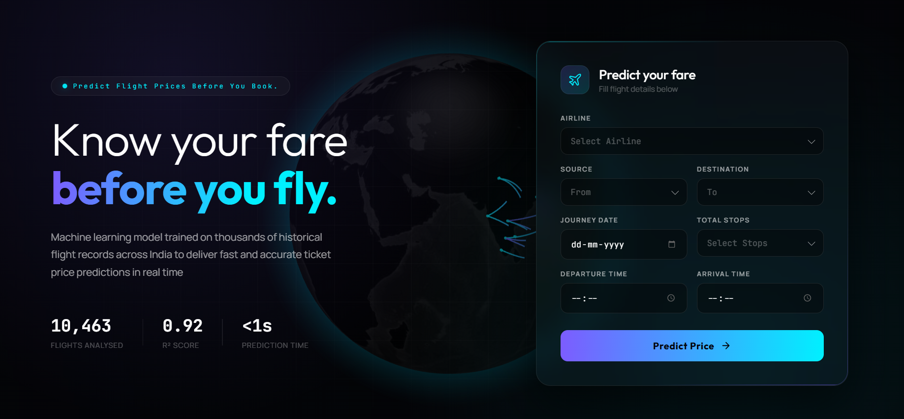

# ✈️ Flight Price Analysis & Prediction Dashboard

<p align="center">
  
</p>

<h1 align="center">
  ✈️ Flight Price Intelligence System
</h1>

<p align="center">
  A complete End-to-End Data Analytics & Business Intelligence project to analyze airline pricing patterns, discover travel insights, and build an interactive Power BI dashboard and a website.
</p>

<p align="center">
  🚀 Python • SQL • Power BI • Data Visualization • Analytics • Machine Learning
</p>

---

# 🌐 Project Overview

Flight ticket prices change continuously based on multiple factors such as:

* ✈️ Airline
* 🛫 Source & Destination
* 🕒 Departure Time
* 🛬 Arrival Time
* 📅 Journey Duration
* 🔁 Number of Stops
* 📆 Days Before Departure

This project transforms raw flight data into meaningful business insights using **Data Cleaning, Exploratory Data Analysis, SQL Analysis, and Power BI Dashboard Development**.

The final dashboard provides an interactive experience to understand pricing trends and identify factors affecting flight costs.

---

# 🎨 Dashboard Preview

<p align="center">
  
</p>

### Dashboard Features

✨ Interactive airline analysis
✨ Route-wise price comparison
✨ Cheapest & expensive flight insights
✨ Price trend visualization
✨ Source-Destination filtering
✨ Flight duration analysis
✨ Stop-wise pricing behavior

---

# 🧠 Project Architecture

```
                 Raw Flight Dataset
                         |
                         ↓
              Data Cleaning & Processing
                         |
                         ↓
              Exploratory Data Analysis
                         |
                         ↓
              SQL Business Analysis
                         |
                         ↓
              Power BI Data Modeling
                         |
                         ↓
          Interactive Flight Intelligence Dashboard
                         |
                         ↓
                      Website
                         |
                         ↓
                 Website Deployment
```

---

# 🛠️ Tech Stack

<div align="center">

| Technology | Purpose |
|------------|---------|
| 🐍 Python | Data Cleaning, EDA & Machine Learning |
| 🐼 Pandas | Data Processing & Feature Engineering |
| 📊 Matplotlib / Seaborn | Exploratory Data Visualization |
| 🧮 Scikit-learn | Model Training & Prediction |
| 🤖 Machine Learning | Flight Price Prediction Model |
| 🗄️ SQL | Data Analysis & Business Queries |
| ⚡ Power BI | Interactive Business Dashboard |
| 🌐 HTML / CSS / JavaScript | Website Development |
| 🚀 Flask / Streamlit | ML Model Deployment |
| 📁 Excel / CSV | Dataset Storage & Management |
| 🔧 Git & GitHub | Version Control & Project Management |

</div>

---

# 📂 Project Structure

```
Flight-Price-Analysis/

│
├── App/
│   ├── frontend
│   └── backend
│   └── flight_app
│
├── Data/
│   ├── Flight_Price.xlsx
│   └── Clean_Flight_Data.csv
│
├── Images/
│   ├── Airline_Analysis.png
│   └── Executive_Overview.png
│   └── Route_Analysis.png
│   └── Website_Overview.png
│
├── Models/
│   └── flight_price_pipeline.pkl
│
├── Python/
│   ├── 01_Data_Preprocessing_EDA.ipynb
│   └── 02_Machine_Learning.ipynb
│   └── 03_Model_Pipeline.ipynb
│
├── SQL/
│   └── Flight_Price_SQL_Queries.sql
│
├── Power BI/
│   └── Flight_Price_Dashboard.pbix
│
└── README.md
└── requirements.txt
```

---

# 🔍 Data Analysis Workflow

## 1️⃣ Data Collection

Collected flight information containing:

* Airline details
* Route information
* Flight timings
* Duration
* Stops
* Ticket prices

---

## 2️⃣ Data Cleaning

Performed:

✔ Missing value handling
✔ Duplicate removal
✔ Data type correction
✔ Feature transformation
✔ Column standardization

---

## 3️⃣ Exploratory Data Analysis

Analyzed:

📌 Average flight price
📌 Airline performance
📌 Popular routes
📌 Price distribution
📌 Journey duration impact
📌 Number of stops effect

---

# 📊 Power BI Dashboard Pages

## ✈️ Page 1: Flight Price Overview

Key Metrics:

* Total Flights
* Average Price
* Minimum Price
* Maximum Price
* Most Active Airline

Visuals:

* KPI Cards
* Airline Distribution
* Price Analysis Charts

---

## 🌍 Page 2: Route Analysis

Insights:

* Most Popular Routes
* Source-Destination Analysis
* Route-wise Pricing Pattern

Filters:

🎛 Source
🎛 Destination
🎛 Route

---

## ⏱ Page 3: Time & Duration Analysis

Analyzes:

* Departure Time Impact
* Arrival Time Pattern
* Flight Duration vs Price

# 🤖 Machine Learning Workflow

## 1️⃣ Data Preprocessing

Prepared data for ML by:

✔ Handling missing values  
✔ Feature encoding  
✔ Feature engineering  
✔ Data transformation  


## 2️⃣ Model Training

Built prediction models using:

🤖 Regression Algorithms  
🤖 Random Forest  
🤖 Decision Tree  
🤖 XGBoost  


## 3️⃣ Model Evaluation

Evaluated performance using:

📊 MAE  
📊 RMSE  
📊 R² Score  


## 4️⃣ Deployment

Integrated the trained model into the application for real-time flight price prediction.

# 🌐 Website Development Workflow

## 1️⃣ Frontend Development

Created an interactive UI using:

🎨 HTML  
🎨 CSS  
⚡ JavaScript  


## 2️⃣ Backend Integration

Connected the website with ML model using:

🚀 Flask / Streamlit  


## 3️⃣ Prediction System

Workflow:

User Input  
↓  
Web Interface  
↓  
ML Model  
↓  
Flight Price Prediction  


## 4️⃣ Deployment

Deployed the application for real-time user predictions.

---

# 📈 Key Insights

🔹 Airline selection significantly impacts ticket prices.

🔹 Flights with fewer stops generally have higher prices.

🔹 Longer journey duration does not always mean cheaper tickets.

🔹 Popular routes show strong pricing variation.

🔹 Advance booking patterns influence ticket cost.

---

# 🎯 Business Applications

This project can help:

✈️ Airlines optimize pricing strategies
🧳 Travelers find better booking options
📊 Businesses understand market trends
📈 Analysts identify pricing patterns

---

# 📸 Project Gallery

### 📊 Power BI Dashboard

<p align="center">
  
  
</p>

<p align="center">
  
</p>


## 🌐 Web Application

<p align="center">
  
</p>

---

# 👨‍💻 Author

**Sujii**

Data Analytics Portfolio Project

## 👨‍💻 Skills

* 🐍 Python
* 📊 Data Analysis & Visualization
* 🗄️ SQL
* ⚡ Power BI & Business Intelligence
* 🤖 Machine Learning & Predictive Modeling
* 🌐 Web Development
* 🚀 ML Model Deployment

---

# ⭐ Support

If you like this project, consider giving it a ⭐ on GitHub.

Your feedback and suggestions are always welcome!

---

<p align="center">
  ✈️ Turning Flight Data into Business Intelligence 🚀
</p>
